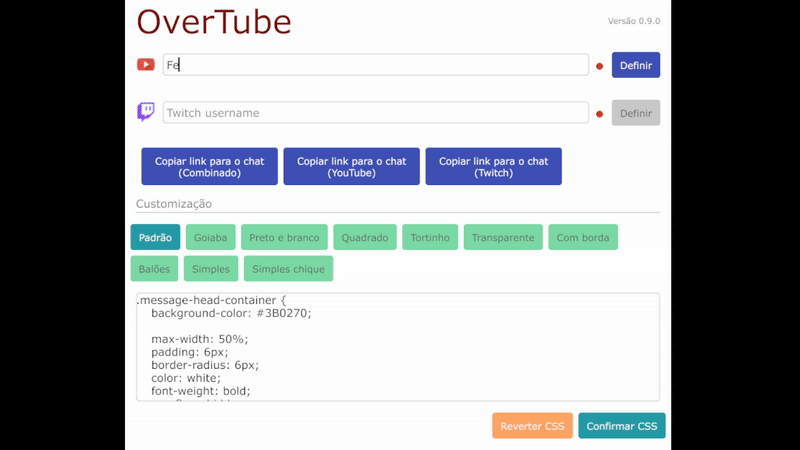

# OverTube
OverTube é uma ferramenta de chat ao vivo para usar junto do seu programa de transmissão, como o OBS. Um chat será gerado e poderá ser usado como fonte web/navegador do OBS para exibir na live.  

Algumas características do OverTube:
1. Fácil de usar
2. Gratuito
3. 10 modelos diferentes de chat para escolher e trocar a qualquer momento
4. Reconecta automaticamente caso sua internet oscile
5. Suporte a Twitch e YouTube, podendo exibir em um único chat com ícones diferenciando os dois
6. Possibilidade de usar 2 chats, sendo um para cada plataforma
7. Suporte a emotes customizados como BTTV e 7TV, além dos nativos das plataformas
8. Salva automaticamente suas configurações. Dessa forma, na próxima live basta abrir o OverTube que tudo já estará pronto
9. Permite customizar o CSS de cada um dos modelos de chat
10. Feedback em tempo real sobre se a conexão com o chat está ativa ou caiu

## Como baixar
Sendo um programa de código aberto, esta página contém todo o código-fonte do projeto. Mas, se você apenas deseja baixar e usar, basta clicar neste link para acessar a versão mais recente: [v0.9.0](https://github.com/MatheusAlvesA/OverTube/releases/tag/v0.9.0) e então clicar em **OverTube.exe**.

## Como usar
O OverTube tem foco em ser simples de usar. Ao baixar o programa não é necessário instalar, basta abrir e ele já estará pronto. Como o programa foi desenvolvido recentemente, ele pode ser considerado suspeito pelo seu antivírus. Isso não é um indicativo de vírus, apenas uma precaução por se tratar de um arquivo desconhecido. Adicione uma exceção para o OverTube e execute.  

Se o bloqueio for a tela do Windows com título: **"O Windows protegeu o computador"**, clique em **"Mais informações"** e depois em **"Executar mesmo assim"**.

### Usando de forma básica
  
O OverTube só tem uma tela, não existem outros menus. Preencha seu canal do YouTube e/ou Twitch e então clique em **Definir**. Verifique se os indicadores, que estavam vermelhos, ficam verdes.  

Em seguida clique em **Copiar link para o chat (combinado)**. Com o link copiado, vá até seu programa de transmissão, adicione uma nova fonte do tipo navegador/web e cole o link.  

O chat já está configurado e pronto para usar. Da próxima vez que abrir o programa, os canais já estarão preenchidos e não será necessário fazer nada.  

Se quiser, explore os botões de customização para ver qual modelo te agrada mais.

### Usando de forma completa
Agora que você já entendeu o básico de como o OverTube funciona, vamos entender o restante. Esta parte é totalmente opcional, mas recomendada se quiser customizar melhor o seu chat.  

Observe a imagem a seguir. Existem áreas marcadas e numeradas; em seguida, cada ponto será explicado.  


1. Esta é a versão do seu OverTube. É um botão que, quando clicado, leva para a página do projeto onde você pode verificar por atualizações.
2. Aqui você preenche seus canais. Não insira o link do canal nem símbolos como **@**, apenas o nome/username do canal na plataforma. O pequeno círculo vermelho indica o status da conexão.
3. Estes são os botões para copiar o link que será colado no OBS. O da esquerda é o principal, mas é possível copiar links que exibem chats exclusivos de uma plataforma. Assim, você pode ter mais de um chat na tela e separar por plataforma.
4. Estes são os botões para escolher qual modelo de chat será usado. Ao clicar, o chat será atualizado na tela automaticamente.
5. Cada modelo de chat pode ser customizado individualmente. Basta usar esta caixa de texto, que contém o CSS completo do modelo selecionado.
6. Ao usar a caixa de texto do item 5, pressione **Confirmar CSS** para que o novo CSS seja aplicado e o chat recarregue automaticamente. Essas configurações ficam salvas para quando você reabrir o programa. **Reverter CSS** desfaz qualquer mudança e retorna o chat ao modelo original.

## Como desenvolver
Será necessário ter as seguintes tecnologias instaladas:
* Go versão >= 1.24.6
* Git
* go-winres

O desenvolvimento do projeto foi feito inteiramente no Windows, por isso não posso garantir compatibilidade com Linux e Mac.  

Como baixar e compilar o projeto:  
```
git clone https://github.com/MatheusAlvesA/OverTube.git
go install github.com/tc-hib/go-winres@latest
cd OverTube
go-winres make
go build -ldflags="-H windowsgui"
```

Se o processo ocorrer com sucesso, será gerado um novo arquivo na pasta do projeto: **overtube.exe**  
Este projeto está sob a licença GPL-3. Ele pode ser copiado e modificado, mas deve ser mantido em código aberto.
