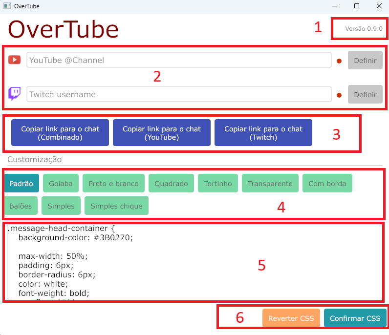

# OverTube
OverTube é uma ferramenta de chat ao vivo para usar junto do seu programa de transmissão, como o OBS. Um chat será gerado e poderá ser usado como fonte web/navegador do OBS para exibir na live.  

Algumas caracteristicas do OverTube:
1. Fácil de usar
2. Gratuito
3. 10 modelos diferentes de chat para escolher e trocar a qualquer momento
4. Reconecta automaticamente caso sua internet ocile
5. Suporte a Twitch e Youtube podendo exibir em um único chat, com icones diferenciando os dois
6. Possibilidade de usar 2 chats, sendo um para cada plataforma
7. Suporte a emotes customizados como BTTV e 7TV, além dos nativos das plataformas
8. Salva automaticamente suas configurações, dessa forma na próxima live basta abrir o OverTube que tudo já estará pronto
9. Permite customizar o CSS de cada um dos modelos de chat
10. Feedback em tempo real sobre se a conexão com o chat está ativa ou caiu

## Como baixar
Sendo um programa de código fonte aberto, essa página tem todo o código fonte do projeto, mas se você apenas deseja baixar e usar, basta clicar nesse link para acessar a versão mais recente: [v0.9.0](https://https://github.com/MatheusAlvesA/OverTube/releases/tag/v0.9.0) e então clique no link OverTube.exe

## Como usar
O OverTube tem foco em ser simples de usar. Ao baixar o programa não é necessário instalar, basta abrir e ele já vai estar pronto. Como esse programa foi desenvolvido recentemente, ele pode ser considerado estranho para seu antivirus. Isso não é um indicativo de virus é apenas uma precaução do anti-virus em não executar arquivos desconhecidos. Adicione uma exceção para o OverTube e execute. Se o bloqueio for a tela do Windows com título: "O Windows protegeu o computador", então apenas clique em "Mais informações" e depois em "Executar mesmo assim".

### Usando de forma básica

OverTube só tem uma tela, não existem outros menus. Preencha seu canal do Youtube e/ou Twitch e então clique em definir. Verifique se os indicadores, que estavam vermelhos, ficam verdes.  
A seguir clique em "Copiar link para o chat (combinado)", com o link copiado vá até seu programa de transmissão e adicione uma nova fonte do tipo navegador/web e cole o link que acabou de copiar.  
O chat já está configurado e pronto para usar, da próxima vez que abrir o programa, os canais já vão estar preenchidos e não será necessário fazer nada.  
Se quiser, explore os botões de customização para ver qual modelo te agrada mais.

### Usando de forma completa
Agora que já entendeu o básico de como o OverTube funciona, vamos entender todo o resto, essa parte é totalmente opcional, mas é recomendada se quiser customizar melhor o seu chat.  
Observe a imagem a seguir. Existem áreas marcadas e numeradas, em seguida cada um dos pontos enumerados serão explicados.  

1. Está é a versão do seu OverTube, é um botão que quando clicado leva para a página do projeto onde você pode verificar por atualizações.
2. Aqui você preenche seus canais, não preencha o link do canal nem simbolos como @, apenas preencha o nome/username do canal na plataforma. O pequeno circulo vermelho indica o status da conexão.
3. Esses são os botões para copiar o link que será colado no seu OBS. O da esquerda é o principal, mas é possível copiar links que exibem chats exclusivos de uma plataforma. Usando esses botões você pode ter mais de um chat na tela e separar por plataforma.
4. Esses são os botões para escolher qual modelo de chat vai usar, ao clicar o chat será atualizado na tela automaticamente.
5. Cada modelo de chat pode ser customizado individualmente, basta usar essa caixa de texto que contém o CSS completo do modelo selecionado
6. Ao usar a caixa de texto do item 5, pressione "Confirmar CSS" para que o seu novo CSS seja aplicado e o chat recarregue automaticamente, essas confirgurações ficam salvas automaticamente para quando você reabrir o programa. "Reverter CSS" desfaz qualquer mudança no CSS e faz o chat voltar a ser o modelo original.

## Como desenvolver
Serão necessárias as seguintes tecnologias instaladas:
* Go versão >= 1.24.6
* GIT
* go-winres

O desenvolvimento do projeto se deu inteiramente no Windows, por isso não posso garantir a compatibilidade com Linux e Mac.
Como baixar e buildar o projeto:
```
git clone https://github.com/MatheusAlvesA/OverTube.git
go install github.com/tc-hib/go-winres@latest
cd OverTube
go-winres make
go build -ldflags="-H windowsgui"
```
Se o processo correr com sucesso, estará presente um novo arquivo na pasta do projeto: overtube.exe  
Este projeto está sob licença GPL-3, e pode ser copiado e modificado, mas deve ser mantido em código fonte aberto.
